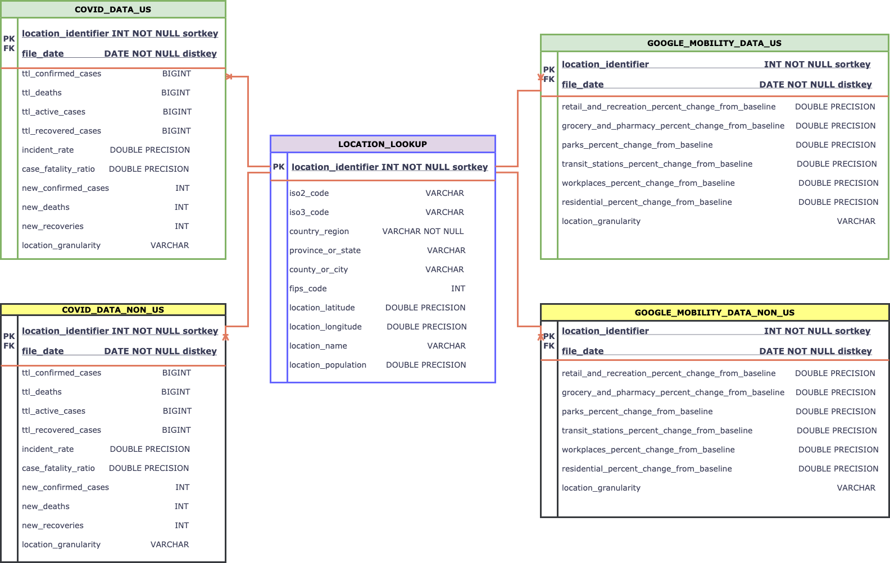

# Udacity Project Repository by Bhargavi Trivedi

This Repository is created as a capstone project for the Udacitys Data Engineering NanoDegree program


# Table of Contents

* [Introduction &amp; Use Case](#introduction--Use-case)

* [Step 1 Scope of the Project &amp; Gathering Data](#step-1-scope-of-the-project--gathering-data)

* [Step 2 Explore &amp; Assess the Data &amp; Step 3 Define the Data Model](#step-2-explore--assess-the-data--step-3-define-the-data-model)

* [Step 4 Run ETL to Model the Data](#step-4-run-etl-to-model-the-data)

* [Step 5 Analytical queires and solutions for different scenarios](#step-5-analytical-queries--solution-to-different-scenarios)

* [Environment Setup](#environment-setup)

* [Data Source reference & Acknowledgment](#data-source-reference--acknowledgment)

* [Files & folders](#files--folders)
</br>

---
## **Introduction &amp; Use Case**

A small media company &#39;Mediafy&#39; based out of US would like to create a webpage with visualizations of covid data across the US &amp; other parts of the world. The company would also like to create awareness &amp; emphasize the importance of staying at home. They would like to show how places with higher covid cases have potentially high mobility. 
For this, they would like to show the trend in covid cases along with the mobility at a given geographical location.

The project manager along with business analysts identified below open data sources that suties the requirement of this project-

- Covid Data - John Hopkins University &amp; Medicine – Coronavirus resource centre
- Mobility Data – Google&#39;s Community Mobility Reports

They would like a Data Engineer to create a data pipeline to ingest this data into our system, create a data model that fits the purpose and make the data available for Data Analysts and BI developers to build the visualizations that can envetually be embedded on Mediafy's webpage.

</br>

---
##                      <center> **DATA PIPELINING PROJECT FOR MEDIAFY**   </center>                  ##
## **Step 1 Scope of the Project &amp; Gathering Data**

### **Scope of the Project**

Create a data pipeline to -
- Pull Covid data &amp; google mobility data files into s3 on a daily basis.
- Load the files from s3 to redshift
- Clean the data
- Load cleaned data into to Redshift to make it available for the BI developers to gather insights from the data.

### **Choice of Tools**

- Airflow for data pipelining &amp; scheduling.</br>
   Why airflow?
    - Covid data &amp; Google mobility data are time-based &amp; are updated daily. There are multiple steps involved in getting the final data. With airflow, the process can be run daily, also providing a user-friendly view of the data pipeline and ease of monitoring.

- Redshift for data storage.</br>
   Why Redshift?
    - The purpose of this data gathering is to store the data and build visualizations on top of it. The data stored will be frequently used &amp; updated daily.
    - Storing data in Redshift would provide ease in querying the data from visualization tools such as Tableau, Power BI etc. which can connect directly to the Redshift warehouse
    - Although the data here is of more than 5M records, the power of spark would still be under-utilized. Moreover, Spark is not the best tool for data storage

### **About the data**

### 1. Covid data

| | |
| --- | --- |
| Source  | John Hopkins University and Medicine Center’s GitHub repository- https://github.com/CSSEGISandData/COVID-19/  <br>The data required for our use case is present under csse\_covid\_19\_data/csse\_covid\_19\_daily\_reports/ directory – Each file is named after the date and consists of combined covid cases data across the world.  |
| Approximate number of rows  | 990K  |
| Data update frequency  | Once per day between 04:45 and 05:15 UTC  |
| File Name Pattern  | <mm-dd-yyyy>.csv (Stored as json in s3 as part of the file ingestion) |
| File Format  | csv  |
| Dataset description  | Dataset contains total covid confirmed cases, deaths, recovered, incident ratio and Case\_fatality\_ratio for a given location at a given date  |
| Granularity of data  | For countries other than US – Covid data by state and country   <br>For US only – Covid data by city/county and occasionally by state  |
| | |

### 2. Location data

| | |
| --- | --- |
| Source  | John Hopkins University &amp; Medicine Center&#39;s GitHub repository- [https://github.com/CSSEGIS&amp;Data/COVID-19/](https://github.com/CSSEGIS&amp;Data/COVID-19/)  |
| Approximate number of rows  | 4700  |
| Data update frequency  | Unknown  |
| File Name Pattern  | UID\_ISO\_FIPS\_LookUp\_Table.csv  |
| File Format  | csv  (Stored as psv.gz in s3 as part of the file ingestion)|
| Dataset description  | Contains information such as population, latitude, longtiude, fips\_code of a given country, province/state &amp; county/city  |
| Granularity of data  | For countries other than US – Record per Country, Occasionally per state  For US only – Record per County as well as per State  &amp; a record for US  |
| | |

### 3. Google Mobility data

| | |
| --- | --- |
| Source  | Google Community Mobility Reports published by google . The data is published on this page by Google: [https://www.google.com/covid19/mobility/](https://www.google.com/covid19/mobility/)  |
| Approximate number of rows  | 4M  |
| Data update frequency  | Twice a week  |
| File Name Pattern  | Global\_Mobility\_Report.csv  |
| File Format  | csv  (Stored as psv.gz in s3 as part of the file ingestion)|
| Dataset description  | Data that shows how people are moving around differently due to covid at a given location on a given day  |
| Granularity of data  | For countries other than US – Covid data by city (occasionally), state &amp; country For US only – Covid data by city/county, state &amp; country  |
| | |
</br>

---
## **Step 2 Explore &amp; Assess the Data &amp; Step 3 Define the Data Model**

### **Data Assessment &amp; Data Model**

Based on the requirements &amp; assessing the data, covid data &amp; google mobility data had following things in common-

1. The time period of data availability
2. Location information
3. Population information
4. And most importantly, the purpose- To make people aware of the mobility around them &amp; create awareness amongst its audience!

Covid data &amp; mobility data can be visualized separately or could also be used for comparison. 
Based on this, the schema that fitted the need is - Galaxy Schema.

### **ER Diagram**



### **Reason to have US data in separate tables**

1. Mediafy is a US based company, &amp; their focus is to provide facts to US-based audience to create awareness.
2. Keeping the US data separate helps improve query performances.
3. The granularity of US covid &amp; google mobility data is higher compared to other location, giving more data points. Keeping the US data separate will help to avoid skewness
4. The reporting &amp; accuracy of US data are higher compared to the rest of the world.

### **Final Table Definition &amp; purpose**

### 1. Table Name: LOCATION\_LOOKUP
- Type of Table: Dimension
- Purpose: To store information related to a location
- Fields:

| | | |
| --- | --- | --- |
| Location\_identifier **(Primary key)**  | INT  | unique key to identify a location (city/state/country).  This is also the sort key to keep data for nearby location in order. For e.g. location\_identifier for the counties in state of Georgia, US will be together which would speed up filtering data. Since there aren&#39;t many locations, the distribution style is &#39;all&#39;  |
| iso2\_code  | VARCHAR  | 2-character iso code for the country  |
| iso3\_code  | VARCHAR  | 3-character iso code for the country  |
| country\_region  | VARCHAR  | Country name. This cannot be NULL  |
| province\_or\_state  | VARCHAR   | Province or state name.  This is NOT NULL for locations at the city/county level. This is NULL for locations at the country level,  |
| county\_or\_city  | VARCHAR  | County or city name. This is NULL for locations at the country/state/province level  |
| fips\_code  | DOUBLE PRECISION  | Fips code of a locaton. Applicable only for US. FIPS code- Federal Information Processing St&amp;ards code which uniquely identified counties &amp; county equivalents in the United States.  |
| location\_latitude  | DOUBLE PRECISION  | Location latitude  |
| location\_longitude  | INT  | Location longitude  |
| location\_name  | INT  | Combined key of county\_or\_city, province\_or\_state, country  |
| location\_population  | INT  | Population at a location  |
| | | |
</br>

### 2. Table Name: COVID\_DATA\_US / COVID\_DATA\_NON\_US
- Type of Table: fact
- Purpose: To store Covid data for given geographical location
- Fields:

| | | |
| --- | --- | --- |
| Location\_identifier **(Primary key)**  | INT  | Unique key to identify a location (city/state/country). This is also the distribution key since the data visualization would be mostly done based on location, thus keeping location wise data in the same partition will speed up the query |
| File\_date ** (Primary key)   | DATE  | Date at which the covid data was reported. This is also the sort key to speed up the time based analysis|
| ttl\_confirmed cases  | BIGINT  | Total number of confirmed covid cases recorded as of \&lt;file\_date\&gt; at location \&lt;locartion\_identifier\&gt;  |
| ttl\_deaths    | BIGINT  | Total number of deaths recorded as of \&lt;file\_date\&gt; at location \&lt;locartion\_identifier\&gt; due to covid  |
| ttl\_recovered\_cases  | BIGINT  | Total number of recovered covid cases as of \&lt;file\_date\&gt; at location \&lt;locartion\_identifier\&gt;   |
| ttl\_active\_cases  | BIGINT  | Total number of active &amp; not recovered covid cases  |
| Incident\_ratio  | DOUBLE PRECISION  | cases per 100,000 persons as of \&lt;file\_date\&gt; at location \&lt;locartion\_identifier\&gt;  |
| Case\_fatality\_ratio  | DOUBLE PRECISION  | Number recorded deaths / Number cases as of \&lt;file\_date\&gt; at location \&lt;locartion\_identifier\&gt;  |
| New\_confirmed\_cases  | INT  | New covid cases report on \&lt;file\_date\&gt; at location \&lt;locartion\_identifier\&gt;   |
| New\_deaths  | INT  | New covid deaths report on \&lt;file\_date\&gt; at location \&lt;locartion\_identifier\&gt;   |
| New\_recoveries  | INT  | New recoveries reported on \&lt;file\_date\&gt; at location \&lt;locartion\_identifier\&gt;  |
| Location\_granularity  | VARCHAR  | Determines if the row is for a county/state/country  |
| | | |
</br>

### 3. Table Name: GOOGLE\_MOBILITY\_DATA\_US / GOOGLE\_MOBILITY\_NON\_US
- Type of Table: fact
- Purpose: To store mobility data (provided by google) at a given geographical location
- Fields:

| | | |
| --- | --- | --- |
| Location\_identifier **(Primary key)**  | INT  | Unique key to identify a location (city/state/country). This is also the distribution key since the data visualization would be mostly done based on location, thus keeping location wise data in the same partition will speed up the query|
| File\_date ** (Primary key)   | DATE  | Date at which the mobility data was reported. This is also the sort key to speed up the time based analysis  |
| retail\_&amp;\_recreation\_percent\_change\_from\_baseline  | DOUBLE PRECISION   | How mobility for places like restaurants, cafes, shopping centers, theme parks, museums, libraries, &amp; movie theaters change compared to a baseline at \&lt;location\_identifier\&gt; on \&lt;file\_date\&gt; Baseline as per [https://www.google.com/covid19/mobility/data\_documentation.html?hl=en](https://www.google.com/covid19/mobility/data_documentation.html?hl=en) : The baseline is the median value, for the corresponding day of the week, during the 5-week period Jan 3–Feb 6, 2020  |
| grocery\_&amp;\_pharmacy\_percent\_change\_from\_baseline    | DOUBLE PRECISION  | Mobility for places like grocery markets, food warehouses, farmers markets, specialty food shops, drug stores, &amp; pharmacies change compared to a baseline at \&lt;location\_identifier\&gt; on \&lt;file\_date\&gt;  |
| parks\_percent\_change\_from\_baseline  | DOUBLE PRECISION  | Mobility for places like local parks, national parks, public beaches, marinas, dog parks, plazas, &amp; public gardens change compared to a baseline at \&lt;location\_identifier\&gt; on \&lt;file\_date\&gt;  |
| transit\_stations\_percent\_change\_from\_baseline  | DOUBLE PRECISION  | Mobility for places like public transport hubs such as subway, bus, &amp; train stations change compared to a baseline at \&lt;location\_identifier\&gt; on \&lt;file\_date\&gt;  |
| workplaces\_percent\_change\_from\_baseline  | DOUBLE PRECISION  | Mobility for places of work change compared to a baseline at \&lt;location\_identifier\&gt; on \&lt;file\_date\&gt;  |
| residential\_percent\_change\_from\_baseline  | DOUBLE PRECISION  | Mobility for places of residence change compared to a baseline at \&lt;location\_identifier\&gt; on \&lt;file\_date\&gt;  |
| Location\_granularity  | VARCHAR  | Determines if the row is for a county/state/country  |
| | | |
</br>

---
## **Step 4 Run ETL to Model the Data**

### **Airflow DAGS &amp; their purpose** 

1. **Create\_connection.py**
    - Create airflow connections based on the connection info specified in plugins/helpers/connection\_info.py.
    - This DAG should be runs ONCE before running any other DAG.

2. **load\_covid\_and\_mobility\_data\_daily.py** 
    - This DAG should be run once a day at 6PM PST.
    - Flow of the DAG at a high level [Click here for details](#flow-diagram-of-daily-dag-with-explanation)
      1. Create Tables in Redshift if they donot exist already
      2. Pull Covid data file for previous day into s3
      3. Pull google mobility data file into s3
      4. Pull location lookup file into s3
      5. Load the files from s3 into staging tables on s3
      6. Clean the data by running queries in plugins/helpers/sql\_statements.py
      7. Load cleaned data into to Redshift final table
            |                    |
            | ------------------ |
            | a. Covid\_data\_us |
            | b. Covid\_data\_non\_us|
            | c. Google\_mobility\_data\_us|
            | d. Google\_mobility\_data\_non\_us|
            | e. Location\_lookup|
            |  |
      8. Check staging &amp; final data quality
      9. Drop all the staging tables at the end

3. **load\_covid\_&amp;\_mobility\_data\_historical.py** 
    - This DAG should be run ONLY once before starting to runload\_covid\_&amp;\_mobility\_data\_daily.py DAG, to catchup on the historical data that have been retrieved so far. This DAG does following tasks -
    - Flow of the DAG at a high level 
      1. Create Tables in Redshift if they do not exist already
      2. Load preexisting files from s3 into staging tables on s3
      3. Clean the data by running queries in plugins/helpers/sql\_statements.py
      4. Load cleaned data into to Redshift final table-
            |                    |
            | ------------------ |
            | a. Covid\_data\_us |
            | b. Covid\_data\_non\_us|
            | c. Google\_mobility\_data\_us|
            | d. Google\_mobility\_data\_non\_us|
            | e. Location\_lookup|
            |  |

      5. Check staging &amp; final data quality
      6. Drop all the staging tables at the end

    - **NOTE:** load\_covid\_&amp;\_mobility\_data\_daily.py can also be used to do the catch by changing.
            Start\_time &amp; catchup arguments of the DAG to a back date. 

</br>


### ***Flow Diagram of Daily DAG with explanation***


  **Explanation of each task -**

| **Seq No** | **Task Id** | **Task operator** | **Functionality** |
| --- | --- | --- | --- |
| **1** | create\_redshift\_table   | create\_redshift\_tables.py   | Create staging &amp; final tables if they do not exist already. The table definitions are stored in helpers/ create\_tables.py   |
| **2** | pull\_google\_mobility\_data\_file\_into\_s3 </br> pull\_covid\_data\_file\_into\_s3 </br> pull\_location\_lookup\_file\_into\_s3  |  pull\_file\_from\_remote\_into\_s3.py   | 1. Download the google mobility data file from the URL passed as an argument to the task, into local directory</br></br>**For google mobility data &amp; location lookup data**: </br>2. Convert the file from .csv to .psv (fields are separated by a pipe separated instead of a comma) while downloading to local</br>3. Gzip the file</br>4. Move the file into s3 location passed as an argument</br>**Note:** changing the file to .psv ensures that the fields with comma within the value are loaded without error</br></br>**For covid data**:</br>3. Make the column names consistent (While assessing the data it was    found that some of the column names were changed)</br>4. Add file\_date as anew column in the file</br>5. create a json file out of the downloaded file.</br>6. move json file to s3|
| **3** | copy\_location\_lookup\_data\_from\_s3\_to\_redshift</br>copy\_covid\_data\_from\_s3\_to\_redshift</br>copy\_google\_mobility\_data\_from\_s3\_to\_redshift  | s3\_to\_redshift.py  | 1. Load files from s3 location passed as an argument into redshift table name also passed as argument.</br>2. delimiter, file\_format , file\_format\_path, ignore\_header are some other optional paramters that can  be passed to the operator</br>3. default values </br> - delimiter = &quot;I&quot;</br> - file\_format = &quot;&quot;</br> - file\_format\_path = &quot;auto&quot;</br> - ignore\_header = 1</br>4. Tables that are loaded</br>- location\_lookup\_staging</br> - google\_mobility\_data\_staging</br>- covid\_data\_staging (file format path for covid json file is stoed on s3) |
| **4** | staging\_table\_checks  | data\_quality\_check.py  | Check if the staging tables loaded in previous step have data &amp; are not empty  |
| **5** | upsert\_location\_lookup\_from\_staging\_to\_final  | postgres\_operator.py  | 1. Delete existing rows from location\_lookup where location\_identifier is present in location\_lookup\_staging .</br>2. Load distinct locations from location\_lookup\_staging to location\_lookup</br>3. Update any known value errors.  |
| **6** | insert\_location\_from\_mobility\_staging\_to\_location\_lookup\_final  | postgres\_operator.py  | Insert location info from google\_mobility\_data\_staging into location\_lookup that are not already present in location\_lookup\_final  |
| **7** | fixing\_expected\_anomalies\_in\_staged\_data</br>load\_google\_mobility\_data\_non\_us</br>load\_google\_mobility\_data\_us  | postgres\_operator.py  | **fixing\_expected\_anomalies\_in\_staged\_data** </br>Update query to fix known data issues in the covid\_data\_staging table.</br></br>**load\_google\_mobility\_data\_us**</br>load google mobility data for US city, state &amp; country by running following steps-</br>1. Insert mobility data  by city, state &amp; country by joining google\_mobility\_staging with location\_lookup into the staging table - google\_mobility\_data\_us\_staging.</br>2. De-duplicate data in google\_mobility\_data\_us\_staging table for each location\_identifier based on last\_update\_dt.</br>3. Delete existing rows from google\_mobility\_data\_us final table.</br>4. Finally, insert deduplicated rows from google\_mobility\_data\_us\_staging into the final google\_mobility\_data\_non\_us table.</br></br>**load\_google\_mobility\_data\_non\_us**</br>load google mobility data for non US countries by city, state &amp; country following the same steps as US data except the query to identify the locations is different  |
| **8** | load\_covid\_data\_us</br>load\_covid\_data\_non\_us  | postgres\_operator.py  | **load\_covid\_data\_us**</br>Load covid data for US county &amp; states  by running following steps-</br>1. Insert covid data by county &amp; state by joining covid\_data\_staging with location\_lookup table</br>2. De-duplicate data in the temp table for each location\_identifier &amp; file\_date based on last\_update\_dts</br>3. Delete existing rows from covid\_data\_us final table for incoming location\_identifier &amp; file\_date</br>4. Finally, insert deduplicated rows from temp table into the final covid\_data\_us table</br></br>**load\_covid\_data\_non\_us-**</br>Load covid data for countries other than US by available city, state &amp; country following the same steps as US data  except the query to identify the locations is different  |
| **9** | final\_table\_checks  | data\_quality\_check.py  | Check that final tables-</br>google\_mobility\_data\_us</br>google\_mobility\_data\_non\_us</br>covid\_data\_us</br>covid\_data\_non\_us</br>location\_lookup</br>for below things-</br>1. There are no nulls in the primary key columns of the table</br>2. The final tables are not empty</br>3. primary key columns doesnot have duplicate values  |
| **10** | database\_cleanup\_sqls  | postgres\_operator.py  | Drop below staging tables that were created for loading the data</br>public.covid\_data\_staging;</br>public.google\_mobility\_data\_staging;</br>public.google\_mobility\_data\_us\_staging;</br>public.google\_mobility\_data\_non\_us\_staging;</br>public.location\_lookup\_staging;  |
---
## **Step 5 Analytical Queries & Solution to different scenarios**

## Analytical queries in the form of graphs can be found here- 
## Analytical queries in numbers can be found here -

## Solution to different scenarios
- **If the data was increased by 100x.:**  
  - We could have different tables for different countries just like we have for the US.
  - Increase the size of redshift cluster
  - We can also have separate tables for countries, states and city wise data and can have corresponding lookups. 
- **If the pipelines were run on a daily basis by 7am.:**
  - The current pipeline is well equipped for this scenario as it is pulling file for yesterday.
- **If the database needed to be accessed by 100+ people.:**
  - We can replicate the warehouse in multiple AWS availability zones. Though redshift cannot span multiple AZs, but s3 can. With this, we can download the files into s3 once, and then load the same set of files into warehouses hosted in different regions.
  - Alternatively, we can use the Concurrency Scaling feature of Amazon Redshift. With this feature, Amazon Redshift automatically adds transient capacity when needed to handle massive demand. Please read  https://aws.amazon.com/redshift/faqs/ for details
---
## **Environment Setup**
- Install python version 3.7 or higher
- Steps to Run Airflow on Docker: 
    1. Download Docker from - https://www.docker.com/products/docker-desktop
    2. Install airflow image using - https://github.com/puckel/docker-airflow (Donot build at this pointjust install)
    3. Clone this github repo to a location on your machine 
    4. Set env variable $AIRFLOW\_HOME = \<location-of-github-repo-in-your-machine\>
    5. To start running airflow on docker, run below command at $AIRFLOW\_HOME<br/>
        ```bash up_docker.sh```
    6. To stop the docker instance after use, run below command<br/>
        ```bash down_docker.sh```
    7. Create a Redshift Cluster through the UI or using teraform. Make sure the permissions are place for the cluster to be accessible from airflow server
    8. For this project, the files are stored under s3://btrivedi-udacityproject/ bucket

---

## **Data source reference &amp; acknowledgment**
### **Data Sources:**

- Covid and location Data:
    COVID-19 Data Repository by the Center for Systems Science and Engineering (CSSE) at Johns Hopkins University" 
    url: https://github.com/CSSEGISandData/COVID-19
- Google Mobility Data:
    Google LLC "Google COVID-19 Community Mobility Reports".
    https://www.google.com/covid19/mobility/ Accessed: <date>.

### **Acknowledgements:**

Thank you to the wonderful team at google and JHU who have gathered and organized the data so well and also made it available for everyone.


## **Files & Folders**
- dags/ - Directory to store all the airflow DAGS
- plugins/- Directory to store customer operators and helpers
- up\_docker.sh - shell script to bring Airflow docker container up
- down\_docker.sh - shell script to bring Airflow docker container down
- requirements.txt - list of python packages to install while spinning up airflow instance
- data-analysis/ - Directory with some tableau visualizations of the data and a python notebook