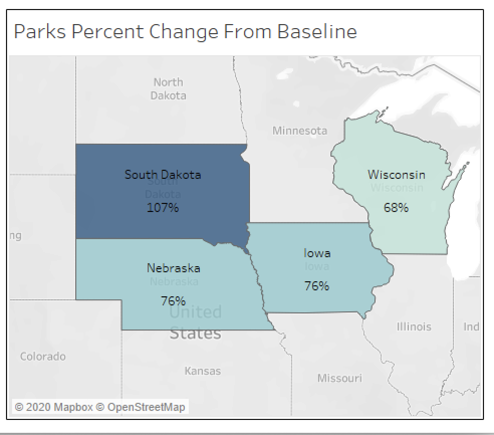
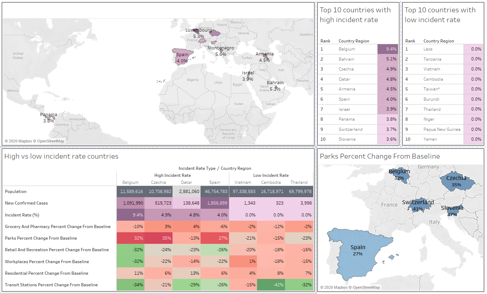

## **Analysis to compare covid incident rate with mobility**
 

---
### **Below Geographic chart shows the incident rate (total_confired_cases/population)% by the states in the US.** ###

#### According to this, it is evident that states like North Dakota (ND), South Dakota (SD), Wisconson (WI) have a higher incident rate compared to other states. Which means more number of people in the overall population got Covid.

#### Normally the attention is on the states with highest number of cases, but this diagram tells a different story about less talked about states.

 

---
### **Below are the 5 states from the top and 5 states from the bottom, based on incident rate** ###
#### Clearly the states with lower incident rate have done a better job in cotrolling covid.

 

---
### **One of the many measures that could prevent spreading of the virus is reduced mobility** ###
#### Below chart shows avg mobility percentage change from baseline for North Dakota (ND) and District of Columbia (DC).

#### Both the states have approximately the same population, but there is a huge difference in incident rate.
#### For ND it is 10.2% where as for DC it is only 3%

#### The percentage change in mobility justifies why that is the case.
#### More people were moving around in ND than in DC.

#### Also,  Residential Percent Change From Baseline for DC is higher than for ND, which means more people were staying home in the DC area.

#### Similarly, below diagram shows the park percentage from baseline was higher in states with higher covid incident rate

## Below Tableau Dashboard shows similar anaysis on Country level data
